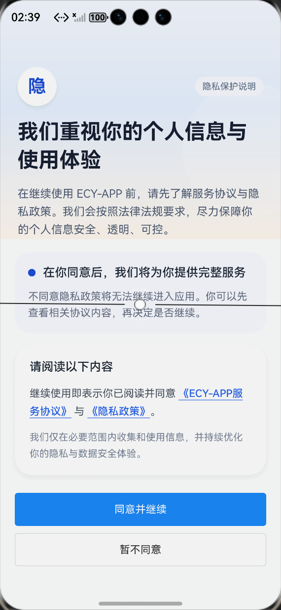
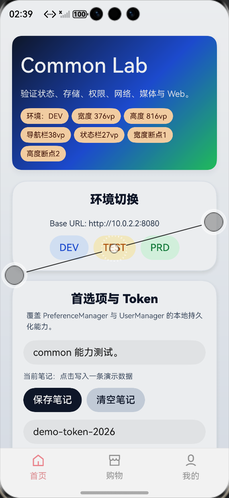
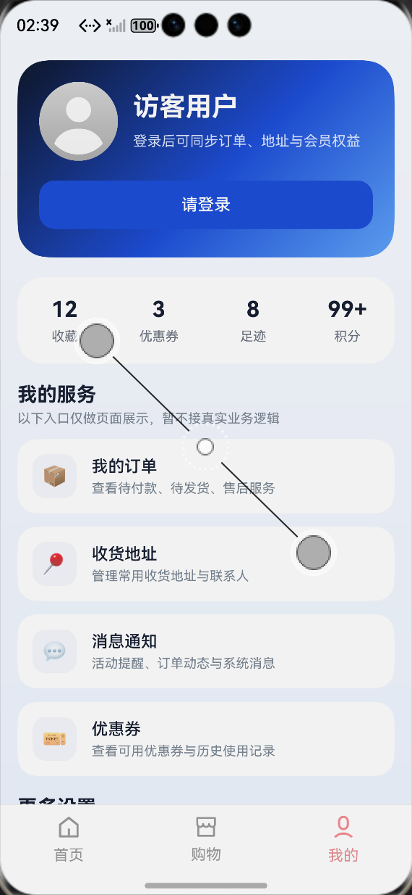

# ecy app

基于 HarmonyOS / ArkTS 的多模块脚手架，轻量型

## 目录结构

```text
ecy_app
├── entry                # 应用入口模块
├── common               # 通用 HAR 模块
├── features/home        # 业务 HAR 模块
├── AppScope             
├── build-profile.json5
└── oh-package.json5
```

## 运行说明

1. 使用 DevEco Studio 打开项目。
2. 选择 `entry` 模块运行到模拟器或真机。

说明：

- 当前默认环境地址配置在 `common/src/main/ets/functions/environment/EnvironmentManger.ets`。

## 页面说明

- `pages/PrivacyPage`：隐私同意页
- `pages/Index`：导航容器入口
- `pages/Main`：底部 Tab 主页面

## 预览图





### 1. 环境切换

```ts
import { EnvironmentManger, EnvEnum } from 'common'

const env = EnvironmentManger.getInstance().getEnv()
const baseUrl = EnvironmentManger.getInstance().getBaseUrl()
EnvironmentManger.getInstance().setEnv(EnvEnum.DEV)
```

### 2. 本地存储

```ts
import { PreferenceManager } from 'common'

PreferenceManager.putSync('demo_key', 'demo_value')
const value = PreferenceManager.getSync('demo_key', '')
PreferenceManager.deleteSync('demo_key')
```

### 3. 用户 Token

```ts
import { UserManager } from 'common'

UserManager.getInstance().setToken('token-demo')
const token = UserManager.getInstance().getToken()
```

### 4. 路由跳转

```ts
import { RouteManager, RouteTable } from 'common'

RouteManager.getInstance().push({ url: RouteTable.ENTRY_MAIN })
RouteManager.getInstance().push({ url: 'https://developer.harmonyos.com/' })
RouteManager.getInstance().pop()
```

### 5. 网络请求

```ts
import { NetManager } from 'common'

const res = await NetManager.getInstance().request({
  method: 'get',
  url: 'https://httpbin.org/get'
})
```

### 6. 权限申请

```ts
import { PermissionManager } from 'common'

const granted = await PermissionManager.requestPermissions(
  ['ohos.permission.LOCATION', 'ohos.permission.APPROXIMATELY_LOCATION'],
  '需要定位权限以继续使用相关功能'
)
```

### 7. 计时器

```ts
import { TimeHelper, TimerType } from 'common'

const timer = TimeHelper.build({
  type: TimerType.COUNT_DOWN,
  maxTimeMs: 60 * 1000,
  triggerTime: 1000,
  onTick: (value: number) => {},
  onReachLimit: () => {}
})

timer.setTimeMs(60 * 1000)
timer.start()
```

### 8. 定位与地理编码

```ts
import { LocationManager } from 'common'

await LocationManager.getInstance().checkAndRequest()

const address = await LocationManager.getInstance().getAddressByLatLon(39.904989, 116.405285)
const geo = await LocationManager.getInstance().getAddressesFromName('上海中心')
```

### 9. 用户能力

```ts
import { UserManager } from 'common'

const token = UserManager.getInstance().getToken()

await UserManager.getInstance().login('13800138000', '1234')
const userInfo = await UserManager.getInstance().getUserInfo()
await UserManager.getInstance().logout()
```

### 10. 断点能力

```ts
import { Breakpoint } from 'common'

const globalState: GlobalState = AppStorageV2.connect(GlobalState)!
const cardWidth = Breakpoint.ofWidth(
  this.globalState.widthBreakpoint,
  '100%',
  '48%',
  '32%',
  '24%',
  '24%'
)
```

### 11. 媒体播放

```ts
import { MediaManager } from 'common'

const mediaManager = await MediaManager.create(getContext(this), {
  mediaList: ['https://www.soundhelix.com/examples/mp3/SoundHelix-Song-1.mp3'],
  playMode: 'SINGLE'
})

await mediaManager.setAndPlay(0)
await mediaManager.pause()
```


