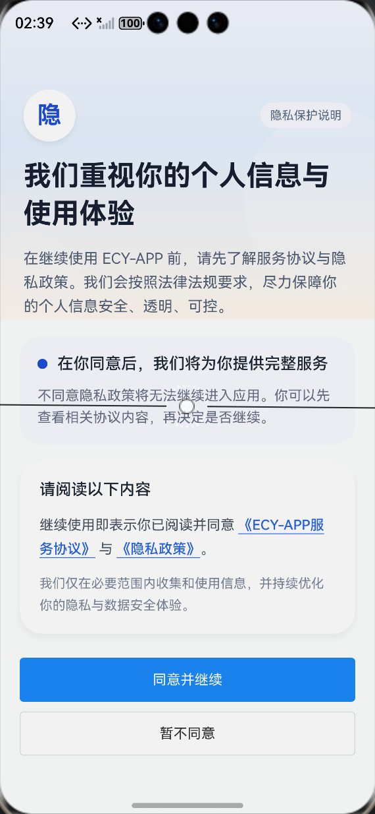
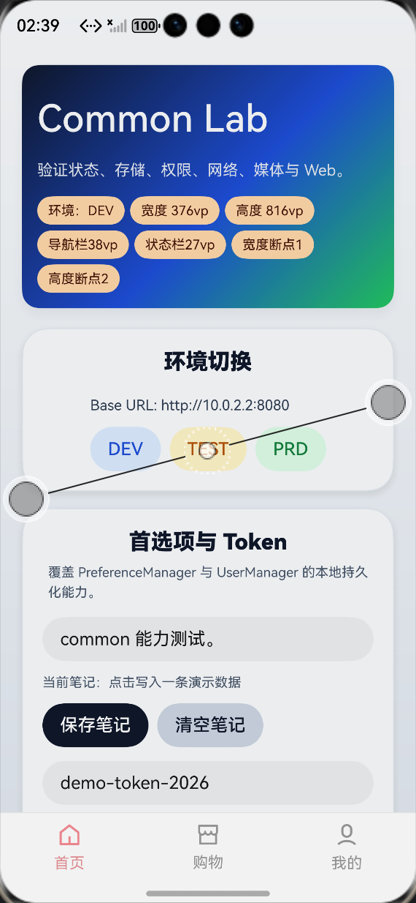
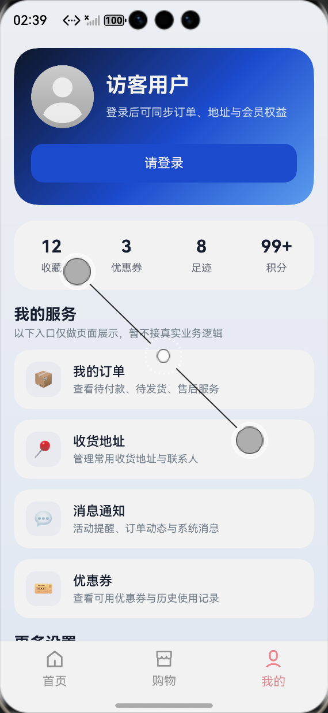

# ecy app

基于 HarmonyOS / ArkTS 的多模块脚手架，轻量封装了常用能力，可作为新项目的起点。

## 技术栈

| 类型 | 内容 |
|------|------|
| 开发语言 | ArkTS |
| 构建工具 | Hvigor |
| SDK | HarmonyOS 6.0.2 |
| HTTP | `@ohos/axios` ^2.2.6 |
| UI 组件库 | `@ibestservices/ibest-ui-v2` ^1.0.5 |

## 目录结构

```text
ecy_app
├── AppScope                 # 应用全局配置与资源
├── entry                    # 应用入口模块（可执行）
├── common                   # 通用 HAR 模块（工具与业务能力）
├── features/home            # 业务 HAR 模块（首页、我的）
├── build-profile.json5
└── oh-package.json5
```

## 运行说明

1. 使用 DevEco Studio 打开项目。
2. 选择 `entry` 模块运行到模拟器或真机。

> 默认环境地址配置在 `common/src/main/ets/functions/environment/EnvironmentManger.ets`。

## 页面说明

| 页面 | 路径 | 说明 |
|------|------|------|
| PrivacyPage | `pages/PrivacyPage` | 隐私同意页，首次启动显示 |
| Index | `pages/Index` | 导航容器入口（NavPathStack） |
| Main | `pages/Main` | 底部 Tab 主页面 |

---

## API 使用示例

### 1. 环境切换

```ts
import { EnvironmentManger, EnvEnum } from 'common'

const env = EnvironmentManger.getInstance().getEnv()       // 获取当前环境
const baseUrl = EnvironmentManger.getInstance().getBaseUrl() // 获取 baseURL
EnvironmentManger.getInstance().setEnv(EnvEnum.DEV)        // 切换环境（会重启应用）
```

### 2. 本地存储

```ts
import { PreferenceManager } from 'common'

PreferenceManager.putSync('demo_key', 'demo_value')
const value = PreferenceManager.getSync('demo_key', '')
PreferenceManager.deleteSync('demo_key')
```

### 3. 用户 Token

```ts
import { UserManager } from 'common'

UserManager.getInstance().setToken('token-demo')
const token = UserManager.getInstance().getToken()
```

### 4. 路由跳转

```ts
import { RouteManager, RouteTable } from 'common'

RouteManager.getInstance().push({ url: RouteTable.ENTRY_MAIN })
RouteManager.getInstance().push({ url: 'https://developer.harmonyos.com/' }) // 自动打开 WebView
RouteManager.getInstance().pop()
```

### 5. 网络请求

```ts
import { NetManager } from 'common'

const res = await NetManager.getInstance().request({
  method: 'get',
  url: 'https://httpbin.org/get'
})
```

### 6. 权限申请

```ts
import { PermissionManager } from 'common'

const granted = await PermissionManager.requestPermissions(
  ['ohos.permission.LOCATION', 'ohos.permission.APPROXIMATELY_LOCATION'],
  '需要定位权限以继续使用相关功能'
)
```

### 7. 计时器

```ts
import { TimeHelper, TimerType } from 'common'

const timer = TimeHelper.build({
  type: TimerType.COUNT_DOWN,
  maxTimeMs: 60 * 1000,
  triggerTime: 1000,
  onTick: (value: number) => { /* 每秒更新 UI */ },
  onReachLimit: () => { /* 倒计时结束 */ }
})

timer.start()
// timer.stop() / timer.resume()
```

### 8. 定位与地理编码

```ts
import { LocationManager } from 'common'

await LocationManager.getInstance().checkAndRequest()

const address = await LocationManager.getInstance().getAddressByLatLon(39.904989, 116.405285)
const geo = await LocationManager.getInstance().getAddressesFromName('上海中心')
```

### 9. 用户能力（登录/登出）

```ts
import { UserManager } from 'common'

await UserManager.getInstance().login('13800138000', '1234')
const userInfo = await UserManager.getInstance().getUserInfo()
await UserManager.getInstance().logout()
```

### 10. 断点响应式布局

```ts
import { Breakpoint, GlobalState } from 'common'
import { AppStorageV2 } from '@kit.ArkUI'

@ComponentV2
struct MyComponent {
  @Local globalState: GlobalState = AppStorageV2.connect(GlobalState)!

  build() {
    Column()
      .width(Breakpoint.ofWidth(
        this.globalState.widthBreakpoint,
        '100%',  // XS
        '48%',   // SM
        '32%',   // MD
        '24%',   // LG
        '24%'    // XL
      ))
  }
}
```

### 11. 媒体播放

```ts
import { MediaManager } from 'common'

const mediaManager = await MediaManager.create(getContext(this), {
  mediaList: ['https://www.soundhelix.com/examples/mp3/SoundHelix-Song-1.mp3'],
  playMode: 'SINGLE'
})

await mediaManager.setAndPlay(0)
await mediaManager.pause()
```

---

## 预览图

<table>
  <tr>
    <td></td>
    <td></td>
    <td></td>
  </tr>
</table>

